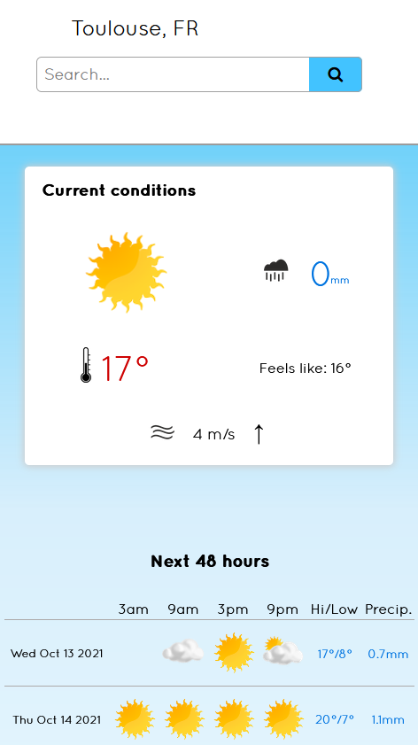

# Weather Forecast App

<!-- TABLE OF CONTENTS -->
  
<h2 style="display: inline-block">Table of Contents</h2>

  

  <ol>
    <li>
      <a href="#about-the-project">About The Project</a>
      <ul>
        <li><a href="#built-with">Built With</a></li>
      </ul>
    </li>
    <li><a href="#demo--screenshots">Demo & Screenshots</a></li>
    <li><a href="#current-issues">Current Issues</a></li>
    <li><a href="#license">License</a></li>
  </ol>

## About The Project

This Weather Forecast App uses the One Call API and Geocoding API from [Open Weather](https://openweathermap.org/api). This fully responsive site gives the current 
weather forecast for any location, using the current local time in the chosen destination, as well as giving a 48 hour and 7 day forecast.

## Live version [here](https://amy-weather.netlify.app/).

### Built With

* HTML
* CSS
* JavaScript
 

## Demo & Screenshots
This Weather Forecast App can be viewed from any screen size :  

    
    
   

  

## Current Issues
* The search bar currently only supports the complete name of a city/town/village name or this name followed by the country code. There is no preview for destinations, to, for example, 
differentiate between York County, US or York, GB. A search for "York" will produce "York County, US", whereas a search for "York, GB" will produce "York, GB". Sometimes the country 
code is necessary to select the correct destination.
 

## Contributing
If you find a bug, please open an issue [here](https://github.com/AmyMaule/weather-forecast/issues/new), including as much information as you can. 
You can request new features or modify current features [here](https://github.com/AmyMaule/weather-forecast/issues/new) - please include search queries and expected results.
 
<!-- LICENSE -->
## License

MIT © [Amy Maule](https://github.com/AmyMaule)
